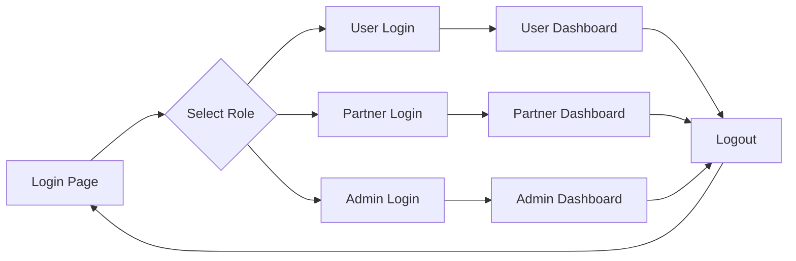

# 🚀 Quick Login Reference

## Test Accounts at a Glance

```
┌─────────────────────────────────────────────────────────────┐
│                    BOOMCARD LOGIN ACCOUNTS                   │
├─────────────────────────────────────────────────────────────┤
│                                                              │
│  👤 REGULAR USER (Consumer)                                 │
│     Email:    demo@boomcard.bg                              │
│     Password: demo123                                        │
│     Access:   View offers, search venues, use discounts     │
│                                                              │
├─────────────────────────────────────────────────────────────┤
│                                                              │
│  🏢 PARTNER (Business Owner)                                │
│     Email:    partner@boomcard.bg                           │
│     Password: partner123                                     │
│     Access:   All User + Manage venues, create offers       │
│                                                              │
├─────────────────────────────────────────────────────────────┤
│                                                              │
│  ⚡ ADMIN (Platform Administrator)                          │
│     Email:    admin@boomcard.bg                             │
│     Password: admin123                                       │
│     Access:   All Partner + System administration           │
│                                                              │
└─────────────────────────────────────────────────────────────┘
```

## Quick Access

**Login Page:** Navigate to `/login` or click "Sign In" in the header

**Auto-fill:** Click "Fill User Account" button on login page

**Switch Roles:** Logout → Login with different credentials

---

## Role Capabilities Comparison

| Feature | User | Partner | Admin |
|---------|:----:|:-------:|:-----:|
| View offers & venues | ✅ | ✅ | ✅ |
| Search & filter | ✅ | ✅ | ✅ |
| Save favorites | ✅ | ✅ | ✅ |
| Use QR codes | ✅ | ✅ | ✅ |
| Write reviews | ✅ | ✅ | ✅ |
| **Create venues** | ❌ | ✅ | ✅ |
| **Create offers** | ❌ | ✅ | ✅ |
| **POS integrations** | ❌ | ✅ | ✅ |
| **Partner analytics** | ❌ | ✅ | ✅ |
| **Billing management** | ❌ | ✅ | ✅ |
| **System admin** | ❌ | ❌ | ✅ |
| **Manage all users** | ❌ | ❌ | ✅ |
| **Platform analytics** | ❌ | ❌ | ✅ |

---

## Testing Workflow



1. **Start:** Go to `/login`
2. **Choose:** Pick a role to test (User/Partner/Admin)
3. **Login:** Enter credentials or click auto-fill
4. **Test:** Explore features available to that role
5. **Logout:** Click profile → Logout
6. **Repeat:** Try another role

---

## Pages by Role Access

### 👤 User Pages
- `/` - Home page
- `/search` - Search venues
- `/favorites` - Saved venues
- `/profile` - User profile
- `/analytics` - Personal analytics

### 🏢 Partner Pages (includes all User pages)
- `/dashboard` - Partner dashboard
- `/my-offers` - Manage offers
- `/integrations` - POS integrations
- `/settings` - Billing & settings
- `/venues` - Manage venues

### ⚡ Admin Pages (includes all Partner pages)
- `/partners` - Manage all partners
- `/users` - Manage all users
- `/system` - System settings
- `/fraud` - Fraud detection
- `/webhooks` - Webhook configs

---

## Quick Commands (Browser Console)

```javascript
// Check current user
const user = JSON.parse(localStorage.getItem('boomcard_auth'));
console.log('Role:', user.role);

// Check authentication status
console.log('Authenticated:', !!localStorage.getItem('boomcard_token'));

// View stored credentials
console.log('User Data:', user);

// Force logout
localStorage.clear();
location.reload();
```

---

## Common Issues & Solutions

| Issue | Solution |
|-------|----------|
| Can't login | Check email/password spelling (case-sensitive) |
| Page access denied | You need Partner/Admin role for that page |
| Session expired | Login again or enable "Remember Me" |
| Wrong dashboard | You're logged in as wrong role, logout & retry |

---

## Security Notes

🔒 **Current Mode:** Development (Mock authentication)
🔒 **Tokens:** JWT with HMAC-SHA256
🔒 **Session:** 15 min (access) / 7 days (refresh)
🔒 **Storage:** Secure cookies + localStorage

---

**Need detailed info?** See [LOGIN_GUIDE.md](LOGIN_GUIDE.md)

**Last Updated:** 2025-10-13
